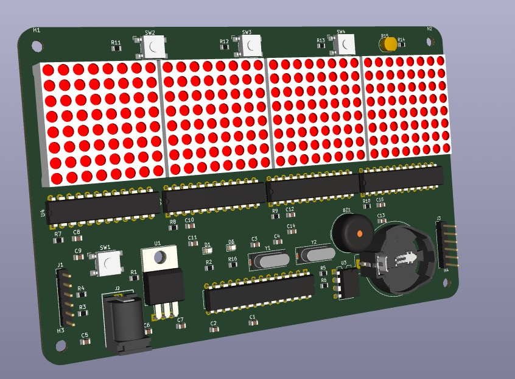

# RedSun_Clock
RedSun_Clock is a PCB-based clock that I designed and developed independently. The project was guided by Mr.Ethan and Mr.Matthew during the Google Hardware Product Sprint (HPS2022 Summer). 

This project consists of two main parts: Hardware and Software.

## Hardware
The hardware part includes the design of the circuit board and the bill of materials (BOM).
Essential components:
LED Matrix  
Micro-controller(atmega328)  
Quartz crystal unit  
Printed Circuit Board  

## Software
The software part is composed of code written in Arduino, which drives the operation of the hardware. And I use KiCAD for PCB design and verification.

## How to compile the code
You can use the Arduino compiler to compile this code.

## Picture

